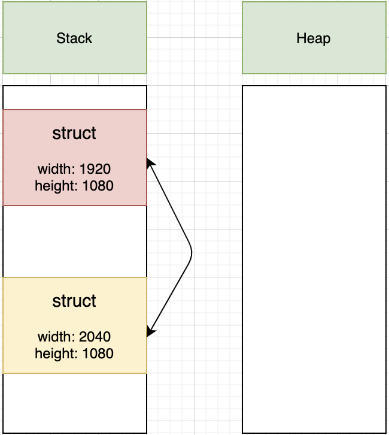
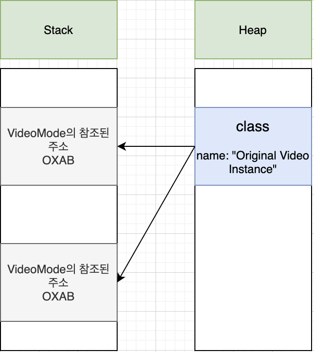

# CH07. Structure and Class


##  - [A. 구조체와 클래스의 기본개념]()

## - [B. 프로퍼티]()

## - [C. 메소드]()

---


## - A. 구조체와 클래스의 기본개념

* 정의

  - 구조체와 클래스는 하나의 큰 코드 블록이다.  변수 또는 상수를 넣어 값을 정의하거나, 함수를 넣어서 기능을 정의할 수도 있음

    

- 구조체의 정의 형식

```swift
struct 구조체이름 {
    // 구조체 정의 내용이 들어갈 부분
}
```

- 클래스의 정의 형식

```swift
class 클래스이름 {
    // 클래스 정의 내용이 들어갈 부분
}
```

- 작성방식 


Ex) 구조체와 클래스 이름의 첫 글자는  대문자로, 나머지 글자는 소문자로 작성한다.

```swift
struct Menu {
    // 첫 글자 M, 나머지 소문자
}
```

Ex) 2개 이상의 복합 단어는 단어별로 끊어 첫 글자는 대문자로, 나머지는 소문자로 작성한다.

```swift
class ViewController {
    // View + Controller 단어별로 끊어 첫 글자는 대문자
}
```

Ex) 이미 축약된 약어는 모두 대문자로 작성 가능하다.

```swift
class FTA {
    // Free Trade Agreement
}
```

Ex) 프로퍼티나 메소드를 선언 할 때는 소문자로 시작한다.

```swift
class ViewController {
    let button = UIButton()  // button 첫 글자 소문자 
    var label = UILabel()    // label  첫 글자 소문자
  
    func buttonAction() {
      // buttonAction 첫글자 소문자
  }
}
```

Ex) 언더바로 단어를연결하는 방식은 지양한다.

```swift
class Name_Of_Class {
    // 위와 같이 언더바 사용하는 것 지양 할 것
}
```

* 메소드와 프로퍼티 
  *  프로퍼티(Property) : 구조체와 클래스 내부에서 정의된 변수나 상수,또는 속성이라고 도 함
  * 메소드(Method) : 구조체와 클래스 내부에 함수를 정의하여 특정 기능을 정의 한 것

```swift
class Resolution {
    var width = 0  // 프로퍼티 혹은 속성
    var height = 0  // 프로퍼티 혹은 속성
  
    // 메소드
    func desc() -> String {  
        return "Resolution 구조체" 
  }
}
```

- 인스턴스
  - 타입의 설계도를 사용하여 메모리 공간을 할당받은 것이 인스턴스이다(실질적인 값을 담는 것).

```swift
struct Resolution {
  var width = 0  // 프로퍼티 혹은 속성
  var height = 0  // 프로퍼티 혹은 속성
  
  // 메소드
    func desc() -> String {  
        return "Resolution 구조체" 
  }
}

let insRes = Resolution()  // 구조체에 대한 인스턴스를 생성하고 상수 insRes에 할당

class VideoMode {
    var interlaced = false
    var frameRate = 0.0
    var name : String?
    
    func desc() -> String {
        return "VideoMode 클래스"
    }
}

let insVMode = VideoMode()  // 클래스에 대한 인스턴스를 생성하고 상수 insVMode에 할당
```

- 점 문법(Dot syntax) : 점 문법을 이용하여 인스턴스의 하위 객체에 접근할 수 있습니다.

  <인스턴스 이름>.<프로퍼티 이름>.<프로퍼티의 서브 프로퍼티 이름>

```swift
struct Resolution {
    var width = 0  
    var height = 0  
  
    func desc() -> String {  
        return "Resolution 구조체" 
  }
}

class VideoMode {
    var interlaced = false
    var frameRate = 0.0
    var name : String?
  	
  	var res = Resolution()
  
    func desc() -> String {
        return "VideoMode 클래스"
    }
}

let vMode = VideoMode()

print("vMode 인스턴스의 width 값은 \(vMode.res.width)")
    // vMode 인스턴스의 width 값은 0입니다.

```

- 초기화

  - 옵셔널 타입으로 선언되지 않은 모든 프로퍼티는 명시적으로 초기화해 주어야 한다.

    - 프로퍼티를 선언하면서 동시에 초기값을 지정하는 경우

    ```swift
    struct Resolution {
        var width = 0 
        var height = 0
    }
    ```

    - 초기화 메소드 내에서 프로퍼티의 초기값을 지정하는 경우

    ```swift
    class VideoMode {
    
        var width: Int
        var height: Int
      
        init(width: Int, height: Int) {
            self.width = width
            self.height = height
      } 
    }
    ```

- 멤버와이즈 초기화 구문(Memberwise Initializer)

  - 구조체는 모든 프로퍼티의 값을 인자값으로 입력받아 초기화하는 기본 초기화구문을 자동으로 제공함

    ```swift
    struct Resolution {
        var width = 0  
        var height = 0  
      
        func desc() -> String {  
            return "Resolution 구조체" 
      }
    }
      
    let defaultRes = Resolution(width: 1024, height: 768)
        // width와 height를 매개변수로 하여 Resolution 인스턴스 생성
    
    print("width:\(defaultRes.width), height:\(defaultRes.height)")
        // width:1024, height:768
    ```

  

- 구조체의 값 전달 방식: 복사에의한 전달

  - 구조체는 인스턴스를 생성한 후 이를 변수나 상수에 할당하거나 함수의 인자값으로 전달할 때 값을 복사하여 전달하는 방식을 사용한다. 이를 값 타입(Value Type), 또는 복사에 의한 전달이라고 한다.

  ```swift
  let hd = Resolution(width: 1920, height: 1080)
  
  var cinema = hd    // hd 와 cinema는 별개의 인스턴스이다.
  
  cinema.width = 2040
  print("cinema 인스턴스의 width 값은 \(cinema.width)입니다.")
      // cinema 인스턴스의 width 값은 2040입니다.
  
  print("hd 인스턴스의 width 값은 \(hd.width)입니다.")
      // hd 인스턴스의 width 값은 1920입니다.
  ```

- Stack과 Heap을 통한 구조체의 값 전달 방식

  - 복사에 의해 전달 되기 때문에 위에 예제에서 hd.width 와 cinema.width는 다른 인스턴스라는 것 을 보여준다

  


-  클래스의 값 전달 방식 : 참조에 의한 전달

  - 클래스는 메모리 주소 참조에 의한 전달 방식을 사용한다. 이를 참조 타입(Reference Type)이라고 한다. 
  - 참조타입은 변수나 상수에 할당될 때, 또는 함수의 인자값으로 전달될 때 값의 복사가 이루어지지않고 인스턴스에 대한 참조(메모리 주소 정보)가 전달된다.

  ```swift
  class VideoMode {
      var interlaced = false
      var frameRate = 0.0
      var name : String?
    	
    	var res = Resolution()
    
      func desc() -> String {
          return "VideoMode 클래스"
      }
  }
  
  let video = VideoMode()
  
  video.name = "Original Video Instance"
  print("video 인스턴스의 name 값은 \(video.name!)입니다.")
      // video 인스턴스의 name 값은 Original Video Instance입니다.
  
  let dvd = video
  dvd.name = "DVD Video Instance"
  print("video 인스턴스의 name 값은 \(video.name!)입니다.")
      // video 인스턴스의 name 값은 DVD Video Instance입니다.
  
  
  ```
  
  - Stack과 Heap을 통한 클래스의 참조 전달 방식
    - 같은 주소를 참조하고 있어서 위의 예제에서 보듯이 dvd 상수에 video를 할당하여 dvd.name을 바꾸더라도 video.name 또한 달라진다.



## - B. 프로퍼티

- 프로퍼티 - 값을 저장하기 위한 목적으로 클래스와 구조체 내에서 정의된 변수나 상수

  

  - 저장프로퍼티 

    - 클래스 내에서 선언된 변수나 상수를 부르는 이름

    - 분류
      - var 키워드로 정의되는 변수형 저장 프로퍼티 - 값을 수정가능
      - let 키워드로 정의되는 상수형 저장 프로퍼티 - 최초 할당된 값이 변경 없이 유지

    - 지연 저장 프로퍼티(Lazy Stored Properties)
      
      - 저장 프로퍼티 앞에 lazy라는 키워드를 붙여서 초기화를 지연 시킴(실제로 호출되는 시점에서 초기화)
    - 인스턴스 초기화가 완료될때까지 초기 값을 가져올 수 없기 때문에, 항상 변수(var키워드 사용)로 선언해야 함. 
      
      ```swift
      class OnCreate {
          init() {
              print("OnCreate!!")
          }
      }
      
      class LazyTest {
          var base = 0
          lazy var late = OnCreate() // lz.late에서 OnCreate가 찍힘
          
          init() {
              print("Lazy Test")
          }
      }
      
      let lz = LazyTest()    // "Lazy Test"
      
      lz.late    // "OnCreate"
      ```
    ```
    
    - 클로저를 이용한 저장프로퍼티 초기화

      - 구문형식
    
      ```swift
      let/var 프로퍼티명: 타입 = {
      				정의내용
       				return 반환값
    }()
    ```

      - 구현 예제 - 클래스나 구조체의 인스턴스가 생성될 때 함께 실행되어 초기값을 반환하고, 이후로는 해당 인스턴스 내에서 재실행되지 않음
    
      ```swift
      class PropertyInit {
        		// 저장프로퍼티 - 인스턴스 생성 시 최초 한 번만 실행
          var value01: String! = {
              print("value01 execute")
            	return "value01"
          }() // ()실행연산자
          let value02: String! = {
              print("value02 execute")
              return "value02"
          }()
      }
      
      let s = PropertyInit()
         
      /*
      실행 결과
      value01 execute
      value02 execute 
      */
      
      /*
      실행결과없음
      */
      s.value01
    s.value02
      ```

    - 클로저를 이용한 lazy 구문

      - 참조되는 시점에서 초기화되며 처음 한 번만 실행된 후에는 다시 값을 평가하지 않는 특성을 지님
    
      ``` swift
      class PropertyInit {
        		// 저장프로퍼티 - 인스턴스 생성 시 최초 한 번만 실행
          var value01: String! = {
              print("value01 execute")
            	return "value01"
          }()
          
        	let value02: String! = {
              print("value02 execute")
              return "value02"
          }()
      		
        	lazy var value03: String! = {
              print("value03 execute")
              return "value03"
          }()
      	
      }
      
      let s1 = PropertyInit()
      /*
      실행결과
      value01 execute
      value02 execute
      */
      
      s1.value03
      /*
      실행결과
      value03 execute
      */
      
      ```
    
    s1.value03
      // 두번째 호출에서는 실행결과가 없음
    
      ```
      
      
      ```

- 연산프로퍼티

  - 실제 값을 저장했다가 반환하지는 않고 대신 다른 프로퍼티의 값을 연산 처리하여 간접적으로 값을 제공합니다. 

  - 연산 프로퍼티는 선택적으로 set 구문을 추가할 수도 있음, set 구문이 생략되면 외부에서 연산 프로퍼티에 값을 할당할 수 없음

  - get구문은 연산 프로퍼티에서 필수 요소, get 구문이 생략되면 연산 프로퍼티가 값을 반환하는 기능 자체를 갖지 못함	

      - 구문형식

      ```swift
      class/struct/enum 객체명 { 
          var 프로퍼티명 : 타입 {
              get {
                  필요한 연산 과정
                	return 반환값
              } 
            	set(매개변수명) {
                	필요한 연산구문
              }
          }	
      }
      ```

      - 구문예제

      ```swift
      struct UserInfo {
        	// 저장 프로퍼티 : 태어난 연도
        	var birth : Int!
        	
        	// 연산 프로퍼티 : 올해가 몇년도인지 계산
        	var thisYear: Int! {
            	get {
                	let df = DateFormatter()
                	df.dateFormat = "YYYY"
                	return Int(df.string(from: Date()))
              }
          }
        	var age: Int {
            	get {
                	return (self.thisYear - self.birth) + 1
              }
          }
      }
      
      let info = UserInfo(birth: 1980)
      print(info.age)
      41    // 실행 결과
      ```

      

- 프로퍼티 옵저버

  - 프로퍼티의 값을 직접 변경하거나 시스템에 의해 자동으로 변경하는 경우에 상관없이 일단 프로퍼티의 값이 설정되면 무조건 호출

    - wilSet 정의 구문 - 프로퍼티의 값이 변경되기 직전에 호출되는 옵저버
    - didSet 정의 구문 - 프로퍼티의 값이 변경된 직후에 호출되는 옵저버

    ```swift
    		// willSet 구문
    var <프로퍼티명> : <타입> [(초기값)] {
      	willSet [ (<인자명>) ] {    // 대괄호 부분은 생략 가능
          	<프로퍼티 값이 변경되기 전에 실행할 내용>
        }
    }
    		// didSet 구문
    var <프로퍼티명> : <타입> [(초기값)] {
      	didSet [ (<인자명>) ] {    // 대괄호 부분은 생략 가능
          	<프로퍼티 값이 변경되기 전에 실행할 내용>
        }
    }
    
    		// 예제
    struct Job {
        var income: Int = 0 {
            willSet(newIncome) {
                print("이번 달 월급은 \(newIncome)원입니다.") 
            } // 갑이 변경되기 직전에 호출 되기 때문에 newValue가 newIncome으로 들어온다.
            
    
            didSet { // 값이 변경된 직후에 호출되기 때문에 이전값이 oldValue로 들어온다
                if income > oldValue {  
                    print("월급이\(income - oldValue)원 증가하셨네요. 소득세가 상향조정될 예정입니다.") 
                } else {
                    print("저런, 월급이 삭감되었군요. 그래도 소득세는 깍아드리지 않아요. 알죠?")
                }
            }
        }
    }
    
    var job = Job(income: 1000000)
    job.income = 2000000
    
    		// 실행결과
    이번 달 월급은 2000000원입니다.
    월급이 1000000원 증가하셨네요. 소득세가 상향조정될 예정입니다.
    
    job.income = 1500000
    
    		// 실행결과
    이번 달 월급은 1500000원입니다.
    저런, 월급이 삭감되었군요. 그래도 소득세는 깍아드리지 않아요. 알죠?
    ```


- 타입프로퍼티 

  -  인스턴스를 생성 하지 않고 클래스나 구조체 자체에 값을 저장하게 하는 것

    ```swift
    		// class 내에서 
    static let/var 프로퍼티명 = 초기값
    		// 또는
    class let/var 프로퍼티명 : 타입 {
      	get {
          	return 반환값
        }
      	set {
        }
    }
    
    		// 예시
    struct Foo {
      	// 타입 저장 프로퍼티
      	static var sFoo = "구조체 타입 프로퍼티 값"
      	
      	// 타입 연산 프로퍼티
      	static var cFoo: Int {
        		return 1  	
        }
    }
    
    class Boo {
      	// 타입 저장 프로퍼티 
      	static var sFoo = "클래스 타입 프로퍼티값"
    		
      	// 타입 연산 프로퍼티
      	static var cFoo: Int {
        		return 10  	
        }
      
      	// 재정의가 가능한 타입 연산 프로퍼티 
      	class var oFoo: Int {
          	return 100
        }
    }
    
    print(Foo.sFoo)
    // "구조체 타입 프로퍼티값"
    
    Foo.sFoo = "새로운 값"
    print(Foo.sFoo)
    // "새로운 값"
    
    print(Boo.sFoo)
    // "클래스 타입 프로퍼티값"
    
    print(Boo.cFoo)
    // 10
    ```

    

## - C. 메소드
- 인스턴스 메소드

  - 클래스, 클래스 구조체 또는 열거형과 같은 객체 타입이 만들어내는 인스턴스에 소속된 함수

    - 인스턴스 메소드 선언 예시

      ```swift
      struct Resolution {
        	var width = 0
         	var height = 0
        
        	// 구조체의 요약된 설명을 리턴해주는 인스턴스 메소드
        	func des() -> String {
             "이 해상도는 가로 \(self.width) X \(self.height) 로 구성됩니다."
          }
      }
      
      class VideoMode {
        	var resolution = Resolution()
        	var interlaced = false
        	var frameRate = 0.0
        	var name: String?
        
        	// 클래스의 요약된 설명을 리턴해주는 인스턴스 메소드
        	func desc() -> String {
            	if self.name != nil {
             	    let desc = "이\(self.name!) 비디오 모드는 \(self.frameRate)의 프레임 비율로 표시됩니다."
                return desc
              } else {
                  let desc = "이 비디오 모드는 \(self.frameRate)의 프레임 비율로 표시됩니다."
                	return desc
              }
          }
      }
      
      
      ```

  - 일반함수와 인스턴스 메소드의 차이점

    - 구조체와 클래스의 인스턴스에 소속
    - 메소드 내에서 정의된 변수와 상수 뿐만 아니라 클래스 범위에서 정의된 프로퍼티도 모두 참조할 수 있다는 점
    - Self 키워드를 사용할 수 있다는점( Self 키워든 구조체나 클래스 자신을 가리킴 )
      

- 타입 메소드

  - 인스턴스를 생성 하지 않고 클래스나 구조체 자체에서 호출할 수 있는 메소드

    - 선언예시

      ```swift
      class Foo {
        	// 타입 메소드 선언
        	class func fooTypeMethod() {
            	// 타입 메소드의 구현 내용이 여기에 들어갑니다.
          }
      }
        	let f = Foo()
        	f.fooTypeMethod()  // 오류
        	Foo.fooTypeMethod()
      ```
      


